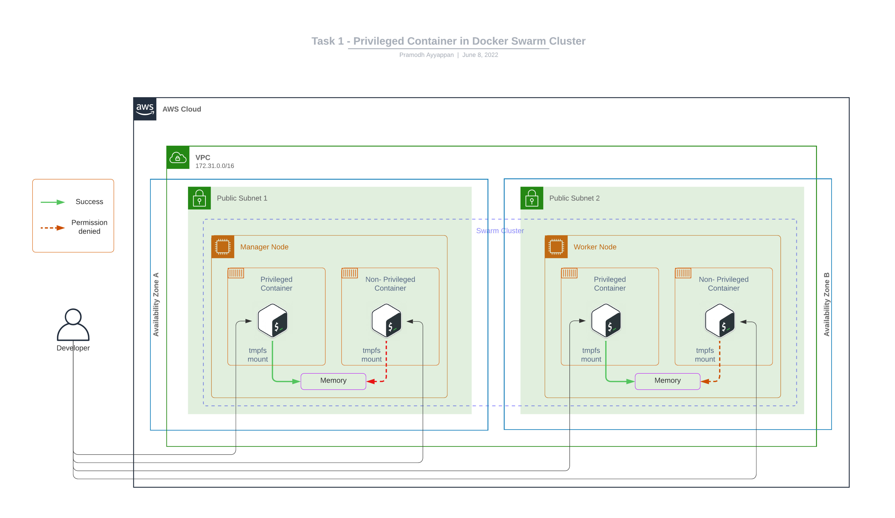

# Task One

Deploy a docker swarm stack that would run a container with `privileged` mode. Once deployed, this privileged container should adhere to the lifecycle of the docker stack.
i.e: `docker stack rm <stack_name>` should remove the service (including the privileged container), and possibly any volumes/networks created.

> Note: _Pick any container image to demonstrate this._

## Solution

### Architecture Diagram



### Pre-requisites

- Create custom docker image using [Dockerfile](Dockerfile) or use the image [pramodhayyappan/kk-task-one-container-handler](https://hub.docker.com/repository/docker/pramodhayyappan/kk-task-one-container-handler) dockerhub in the [docker-compose.yml](docker-compose.yml#12)

    ```bash
    docker build . -t pramodhayyappan/kk-task-one-container-handler
    ```

- To deploy docker stack, we need a docker swarm cluster, refer to the main README to bring up [new nodes](../README.md#cloud-infra-deployment) and create a [swarm cluster](../README.md##stack-deployment)

### Stack deployment

- Clone this repo to the manager node

    ```bash
    git clone https://github.com/pa/kodekloud-assignment.git

    cd kodekloud-assignment/task-one
    ```

- Deploy swarm stack

    ```bash
    docker stack deploy --compose-file docker-compose.yml <stack-name>
    ```

- To Remove swarm stack

    ```bash
    docker stack rm <stack-name>
    ```

#### Output

```bash
# deploy stack
ubuntu@manager:~/kodekloud-assignment/task-one$ docker stack deploy --compose-file docker-compose.yml task-one-stack
Creating service task-one-stack_container-handler

# list stack
ubuntu@manager:~/kodekloud-assignment/task-one$ docker stack ls
NAME             SERVICES   ORCHESTRATOR
task-one-stack   1          Swarm

# list services
ubuntu@manager:~/kodekloud-assignment/task-one$ docker stack services task-one-stack
ID             NAME                               MODE      REPLICAS   IMAGE                                                  PORTS
pxzoaes6u71x   task-one-stack_container-handler   global    2/2        pramodhayyappan/kk-task-one-container-handler:latest

# list running containers
ubuntu@manager:~/kodekloud-assignment/task-one$ docker ps
CONTAINER ID   IMAGE                                                  COMMAND                  CREATED         STATUS         PORTS     NAMES
a55b11424f91   ubuntu                                                 "/bin/bash"              2 minutes ago   Up 2 minutes             non-privileged
3291c1166b0e   ubuntu                                                 "/bin/bash"              2 minutes ago   Up 2 minutes             privileged
713c145663d6   pramodhayyappan/kk-task-one-container-handler:latest   "docker-entrypoint.s…"   2 minutes ago   Up 2 minutes             task-one-stack_container-handler.hqwvw8oagbqgca2u0nsd33q9h.wl7df04kwoq35n2c047wge512

# login to handler container and check if it has access to host docker daemon
ubuntu@manager:~/kodekloud-assignment/task-one$ docker exec -it 713c145663d6 sh
/ # docker ps
CONTAINER ID   IMAGE                                                  COMMAND                  CREATED         STATUS         PORTS     NAMES
a55b11424f91   ubuntu                                                 "/bin/bash"              7 minutes ago   Up 7 minutes             non-privileged
3291c1166b0e   ubuntu                                                 "/bin/bash"              7 minutes ago   Up 7 minutes             privileged
713c145663d6   pramodhayyappan/kk-task-one-container-handler:latest   "docker-entrypoint.s…"   7 minutes ago   Up 7 minutes             task-one-stack_container-handler.hqwvw8oagbqgca2u0nsd33q9h.wl7df04kwoq35n2c047wge512

# login to non-privileged conatiner and try to mount temporary filesystem from with in container
ubuntu@manager:~/kodekloud-assignment/task-one$ docker exec -it non-privileged /bin/bash
root@a55b11424f91:/# mount -t tmpfs none /mnt
mount: /mnt: permission denied.

# login to privileged conatiner and try to mount temporary filesystem from with in container
ubuntu@manager:~/kodekloud-assignment/task-one$ docker exec -it privileged /bin/bash
root@3291c1166b0e:/# mount -t tmpfs none /mnt
root@3291c1166b0e:/# df -h
Filesystem      Size  Used Avail Use% Mounted on
overlay          29G  3.2G   26G  11% /
tmpfs            64M     0   64M   0% /dev
shm              64M     0   64M   0% /dev/shm
/dev/root        29G  3.2G   26G  11% /etc/hosts
none            2.0G     0  2.0G   0% /mnt

# remove swarm stack
ubuntu@manager:~/kodekloud-assignment/task-one$ docker stack rm task-one-stack
Removing service task-one-stack_container-handler

# list stack to see if it is removed
ubuntu@manager:~/kodekloud-assignment/task-one$ docker stack ls
NAME      SERVICES   ORCHESTRATOR
ubuntu@manager:~/kodekloud-assignment/task-one$

# list docker containers to see if priviliged container got removed after docker stack remove
ubuntu@manager:~/kodekloud-assignment/task-one$ docker ps
CONTAINER ID   IMAGE     COMMAND   CREATED   STATUS    PORTS     NAMES
ubuntu@manager:~/kodekloud-assignment/task-one$

```
