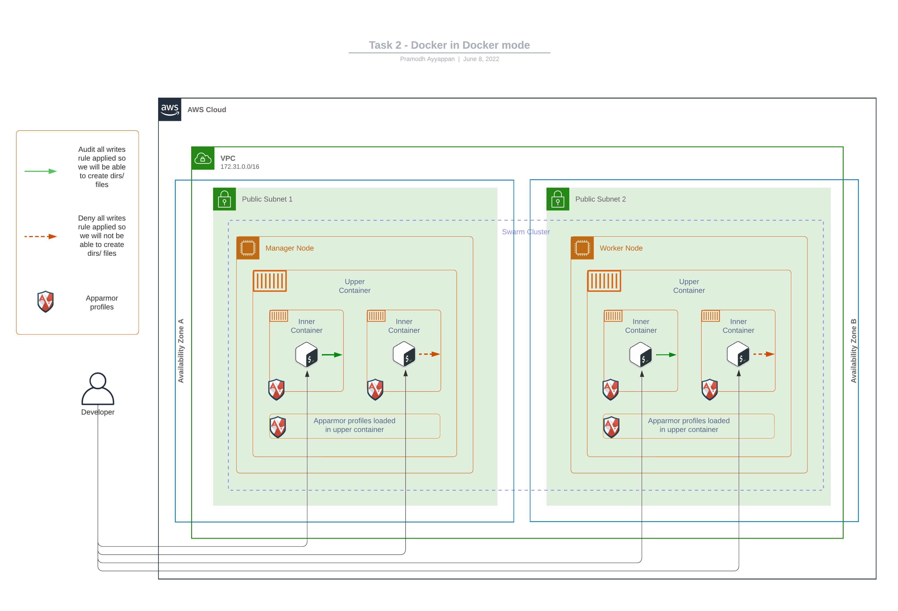

# Task Two

Run an ubuntu based docker container which can inturn run docker inside (docker in docker).
Besides docker, it should also be able to implement apparmor inside (be able to load apparmor modules/ apparmor profile) that can be then be implemented for the inner docker containers.

> Note: _Bonus points if you can deploy this to a swarm cluster_

## Solution

### Architecture Diagram



### Pre-requisites

- Create a custom docker image using [Dockerfile](Dockerfile) or use the image [pramodhayyappan/kk-task-two-container-handler](https://hub.docker.com/repository/docker/pramodhayyappan/kk-task-two-container-handler) from dockerhub in the [docker-compose.yml](docker-compose.yml#L12)

    ```bash
    docker build . -t pramodhayyappan/kk-task-two-container-handler
    ```

- To deploy docker stack, we need a docker swarm cluster, refer to the main README to bring up [new nodes](../README.md#cloud-infra-deployment) and create a [swarm cluster](../README.md#stack-deployment)

### Stack deployment

- Clone this repo to the manager node

    ```bash
    git clone https://github.com/pa/kodekloud-assignment.git

    cd kodekloud-assignment/task-two
    ```

- Deploy swarm stack

    ```bash
    docker stack deploy --compose-file docker-compose.yml <stack-name>
    ```

- To Remove swarm stack

    ```bash
    docker stack rm <stack-name>
    ```

#### Output

```bash
# deplo stack
ubuntu@manager:~/kodekloud-assignment/task-two$ docker stack deploy --compose-file docker-compose.yml task-two-stack
Creating service task-two-stack_container-handler

# list stack
ubuntu@manager:~/kodekloud-assignment/task-two$ docker stack ls
NAME             SERVICES   ORCHESTRATOR
task-two-stack   1          Swarm

# list services
ubuntu@manager:~/kodekloud-assignment/task-two$ docker stack services task-two-stack
ID             NAME                               MODE      REPLICAS   IMAGE                                                  PORTS
di1mgtvc1mmo   task-two-stack_container-handler   global    2/2        pramodhayyappan/kk-task-two-container-handler:latest

# list running containers
ubuntu@manager:~/kodekloud-assignment/task-two$ docker ps
CONTAINER ID   IMAGE                                                  COMMAND                  CREATED              STATUS              PORTS     NAMES
e40b90d92d2f   cruizba/ubuntu-dind                                    "startup.sh sh"          About a minute ago   Up About a minute             upper-container
0bac8f217a8d   pramodhayyappan/kk-task-two-container-handler:latest   "docker-entrypoint.s…"   About a minute ago   Up About a minute             task-two-stack_container-handler.hqwvw8oagbqgca2u0nsd33q9h.hzszkyphhwrivlbvbr3h9ckax

# login to upper container and list running inner containers
ubuntu@manager:~/kodekloud-assignment/task-two$ docker exec -it upper-container /bin/bash
root@e40b90d92d2f:/# docker ps
CONTAINER ID   IMAGE     COMMAND                  CREATED              STATUS              PORTS     NAMES
a4c3ed20904b   ubuntu    "bash -c 'touch test…"   About a minute ago   Up About a minute             audit-all-writes
49e903a392cb   ubuntu    "bash -c 'touch test…"   About a minute ago   Up About a minute             deny-all-writes

# login to deny-all-writes inner container and try to create a dir/file
# Note press ctrl-x to detach from the inner container
root@e40b90d92d2f:/# docker attach --detach-keys="ctrl-x" deny-all-writes
root@49e903a392cb:/# mkdir hello-world-dir
mkdir: cannot create directory 'hello-world-dir': Permission denied


# login to audit-all-writes inner container and try to create a dir/file
# Note press ctrl-x to detach from the inner container
root@e40b90d92d2f:/# docker attach --detach-keys="ctrl-x" audit-all-writes
root@a4c3ed20904b:/# mkdir hello-world-dir
root@a4c3ed20904b:/#

# Check kernel logs to see if apparmor audit logs are appeneded
ubuntu@manager:~/kodekloud-assignment/task-two$ sudo dmesg | tail -4
[12279.715490] audit: type=1400 audit(1654704872.791:89): apparmor="DENIED" operation="open" profile="deny-all-writes" name="/dev/tty" pid=13533 comm="bash" requested_mask="w" denied_mask="w" fsuid=0 ouid=0
[12279.715546] audit: type=1400 audit(1654704872.791:90): apparmor="DENIED" operation="open" profile="deny-all-writes" name="/dev/pts/0" pid=13533 comm="bash" requested_mask="w" denied_mask="w" fsuid=0 ouid=0
[12544.168874] audit: type=1400 audit(1654705137.234:91): apparmor="DENIED" operation="mkdir" profile="deny-all-writes" name="/hello-world-dir/" pid=13792 comm="mkdir" requested_mask="c" denied_mask="c" fsuid=0 ouid=0
[12645.421279] audit: type=1400 audit(1654705238.482:92): apparmor="AUDIT" operation="mkdir" profile="audit-all-writes" name="/hello-world-dir/" pid=13849 comm="mkdir" requested_mask="c" fsuid=0 ouid=0


# remove swarm stack
ubuntu@manager:~/kodekloud-assignment/task-two$ docker stack rm task-two-stack
Removing service task-two-stack_container-handler

# list stack to see if it is removed
ubuntu@manager:~/kodekloud-assignment/task-two$ docker stack ls
NAME      SERVICES   ORCHESTRATOR
ubuntu@manager:~/kodekloud-assignment/task-two$

# list docker containers to see if upper container got removed (when upper docker container is removed it will also remove inner containers)
ubuntu@manager:~/kodekloud-assignment/task-two$ docker ps
CONTAINER ID   IMAGE     COMMAND   CREATED   STATUS    PORTS     NAMES
ubuntu@manager:~/kodekloud-assignment/task-two$
```
